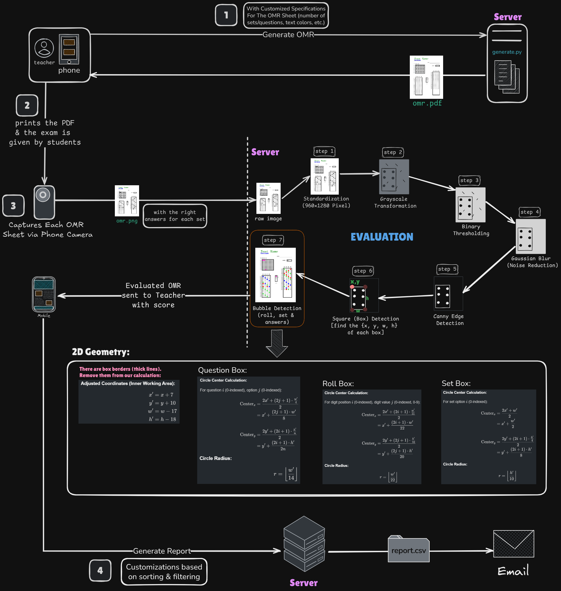

# OMRElite: Computer Vision Mobile App for Evaluating OMR/Bubble Sheet Based Exams

After almost 10K+ lines of code, countless sleepless nights, infinite amount of bug/error fixing later, Introducing "OMRElite"!

The app has been in the making for over a month & still going...
The main moto of the app is to reduce the tedious process of evaluating OMR Sheets by hand which is time consuming & might lead to some wrong evaluations. And using a machine is very costly. Also, the report making process is time killing as well.
But this app can do all these in couple of minutes with few clicks of buttons.
How?

## Well, it has 3 core features:
i. Creating customizable OMR Sheets (the OMR PDF can be printed for examination). 
ii. Evaluating those papers with mobile camera in a short amount of time using computer vision. 
iii. Generating customizable report of all evaluated students (available as a PDF or send it to teacher's email as a .csv file).

### [Click Here](https://youtu.be/AUjXJHea0jA) to Watch the Demo Video

## Architecture

## But there are many minor features as well, like
* If somehow user deletes the PDFs made by the app (mistakenly or to free up storage), then the app can re-generate those PDFs automatically with 1 click of a button.
* If a student mistakenly filled wrong ID number / set, then teacher can manually fix that inside the app.
* There are lots of analysis, like individual student analysis, overall exam analysis. 
* Searching, filtering by name/ID/set etc.

Ummmm, with all these, now it's not even an OMR (Optical Mark Recognition) anymore, right? I think we should call It AMR (Artificial Mark Recognition). JK 😆! But the app has limitations, which I'll try to improve time to time.

## All right, now future goals for OMRElite
### Major:
1) Integrating a database for **creating accounts** so that users can log in to any device with their credentials & all their previous work will be visible.
2) Create a mechanism for joining students via a **joining code**, so that students can join with that **code** & view their own evaluated OMR & overall report.
3) Teacher can select multiple OMRs from gallery and **batch process** them.
4) **Perspective correction & auto-framing:** 
    * Currently the user has to manually click on capture to get the image. 
    * So, i'll try to automate it such a way that the app auto captures the OMR page as soon as the camera detects low blur/frame stability + right perspective/angle before snap. Use stability over ~200ms to auto-trigger.
5) Template system for different OMR Sheets & **custom** designing.
6) Creating a **Web** Version of the app.

### Minor:
1) **Exam Grouping:** Allow teachers to group multiple exams together for better organization and management.
2) Implement a **recycle bin** feature to safely store deleted exams or student data before permanent deletion (30 days).
3) Reduce network latency & improve app performance via **native modules**.

Anyways, in the last couple of months, I've explored a lot about the android Operating System, Image Processing & Cross-Platform Apps.
It's still under development and I'm continuously learning & researching new things and hoping to make OMRElite better 💜.

## Update:
Currently i'm planning to build a hardware device for this.
Right now, one has to evaluate each paper by holding the phone with hand, which might become overwhelming if the there's a lot of OMR papers (let's say 500+).
So, if there were a machine where one will simply put all the OMR papers & adjust the mobile phone on top of that machine in such a way that the machine automatically slides the papers & this app evaluates each paper one by one, then it'll literally eliminate all human intervention.
The machine & the app will have to work in sync btw.
